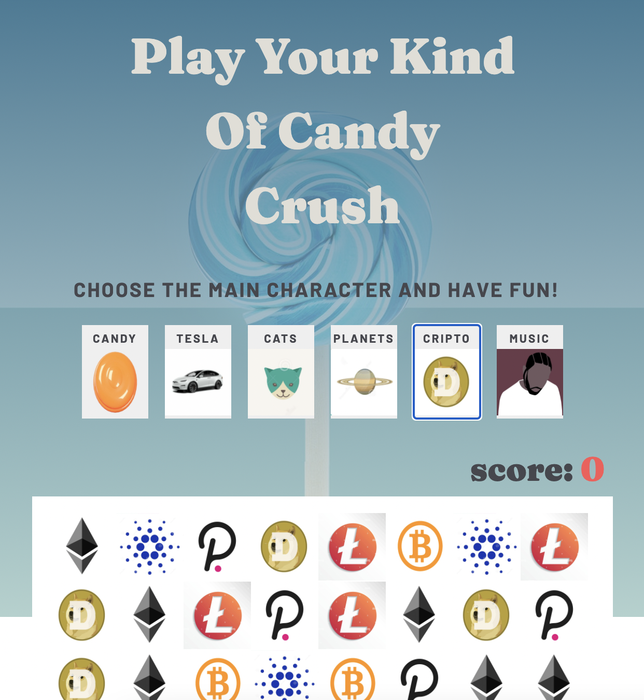
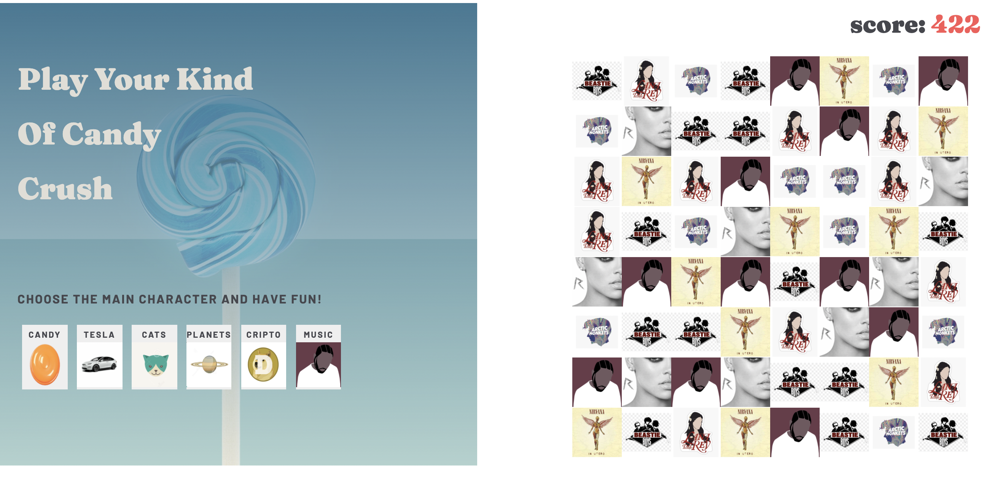

Play your kind of Candy Crush game // React

- [see project](https://sweta-candy-crash.netlify.app)

- The game:
  - Crate board: Create a board of 8 \* 8 squares, each square with random image. On initial load, render a shuffled array with images. With every change in the image arrangement, check for 3/4 columns or rows. Replace the equal images in the column/row with blank images. Move the blank images up until they get entirely replaced by images.
  - User can choose between 6 characters to play with. On a button click, the initial image set is changed, the squareBeingDragged is set to 0 in order to set the initial score to 0.
- [see the tutorial for the game logic](https://www.youtube.com/watch?v=PBrEq9Wd6_U&t=2798s)

    

 

    

 
